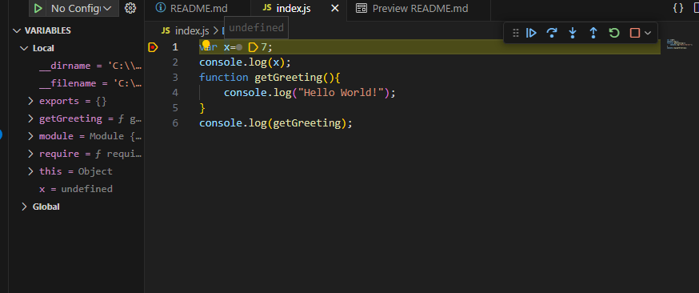

# JavaScript
## Execution Context
- Everything in JavaScript happens inside an Execution Context.
- We can assume this Execution Context as an big container in which whole javascript is executed.
- Execution Context is like a big box where there are two components :-
    * Memory Component
        - Here, all the variables and functions are stored as a key value pair.
        - This memory component is also called as Variable environment.

    * Code component
        - This is the place where the code is executed one line at a time.
        - It is also known as thread of execution.
        - Thread of execution is just like a thread where whole code is executed one line at a time.
    Note:-
    - JavaScript is a synchronous single threaded language. This means it can only execute one command at a time in a specific order. This means it can only go to the next line once the current line has finished executing.

## What happens when you run JavaScript code ?
- When you run a javascript program an execution context is created.
* Code Example 0.1 
```js
    var n=2;
    function square (num){
        var ans = num*num;
        return ans;
    }
    var square2 = square(n);
    var square3 = square(4);
```
- Execution phases is created in two phases.
    * Creation phase ( Memory Creation phase) ( 1st phase)
        - For the code 0.1, JavaScript will allocate the memory for all the variables and functions.
        - Looking at the example 0.1, the variable n and the function square is getting the memory at the Memory component of execution context.
        - Initially variable n stores the special value undefined in the first phase. Similarly, the function square stores the whole code of the function which is defined as it is.
        - Then square2 and square3 will also be allocated the memory. Since both are variables they will be assigned the value undefined.
        - So in the first phase all the variables and functions are read by js line by line and assigned the value by js accordingly. If it is variable it will be assigned undefined and if it is an function whole body of the function will be assigned.
        - undefined is a placeholder and special keyword in js which can be assigned to any variable in the initial phase by js.   
    * Code Execution phase ( 2nd phase)
        - After the Memory allotment, js again scans through the whole code line by line and execute the code.
        - As soon as the js detects the value of n variable is 2, it allocates the value 2 in the memory component for variable n.
        - When the js encounters the square2(n) a brand new execution context is created inside the code component itself. Now, again that execution context will again have memory component as well code component.
        - Inside the new execution context again there will be two phases involves one is creation phase and the second one is code execution phase.
        - All the variables and functions inside this function will be allocated memory in the execution context. 
        - For example the variable num and ans will be allocated memory in the execution context of square2() function call.
        - and then the evaluated or result value will come into the memory section square2 will be assigned the result value.

        
        -  For every function calling a brand new execution context is created which will again have code component and memory section as well.
        - Now all the local scope variables of the function will get the memory in the memory section. And the variables num and ans will be assigned the value as undefined in the initial phase.  
        - In the second phase code execution phase, the num will be assigned the value as 4.
        - ans will be assigned 16 as value in the code execution phase.
        - The return statement will take back the control to the line where the function is called and the corresponding variable value will get changed to the ans.
        - When the js is done with the execution then the execution context will also get released and cleared.
    ### Summary :-
     - There are two phases one is code execution phase and the other one is initial phase and in the initial phase all the variables will be assigned the undefined value and the functions will be assigned the whole function code itself.
     - in code execution phase, all the code written inside the function will be executed line by line. And all the variables will be assigned the actual value mentioned inside the code and if there are expression then those expression will be evaluated to a certain value.
     - Let suppose if there is function call inside the function then separate execution context containing two components memory and code will be created separately.
     - Execution context will always be created inside the code section of the parent execution context.
     - All of these is managed using the Stack which is also called as call Stack.
     ### Call Stack 
      - Call stack is a stack which has the global execution context. Whenever any JavaScript program is run this call stack with global context is populated.
      - Whole execution context is pushed inside its stack. Whenever a function is invoked then that function invocation will result in creation of execution context and that execution context will get push into the call stack. Whenever any execution context finishes the execution then execution is removed from the call stack and the control is again shifted to the execution context just below it in the call stack and ultimately it gives the control to the global execution context.
      - This call stack is only for managing the execution context.
      - At the end the call stack is empty and even the global execution context also vanishes.
      - Call stack maintain the order of execution of execution context. 
      - There are many call stacks names which are popular -
        1. Execution Context Stack
        2. Program Stack
        3. Control Stack
        4. Runtime Stack
        5. Machine Stack
## Hoisting in JavaScript ?
  - 
  - 
  - 
  - 
  ### Initial Phase effect 
  - When we are printing the variable without before the declaration then it is printing undefined.
  - When we are printing the function, before its definition it is printing the whole function itself.
  - This happens because even before the code starts executing the memory is allocated to each and every functions, variables.
  - 
  - variable x is already been allocated the memory, even before the js code starts executing. 
  - JS has special keyword undefined for allocating it to the variables which are not been executed yet in the initial phase.
  - Similarly, for the function in the initial phase it gets the value as actual copy of the function.
  - 
  - Even before the code starts executing the memory is allocated to each and every function and variables.
  - All the variables will be assigned the value undefined and all the function will be assigned the function body itself.
  You must declare the variable before using it otherwise it will give you the reference error.
  - Similarly if you are calling the function before the declaring it and creating that function normally then it will get executed and works fine.
  - However, if you are using the arrow function it will behave like an normal variable that will be assigned undefined not the function body in the memory allocation phase.
  - Thus, calling the arrow function before code execution will give you error.
  
  - Even if you are not using the arrow function and using the variable to assign the function, it will just behave like a variable.
  

