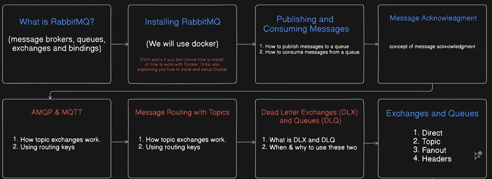
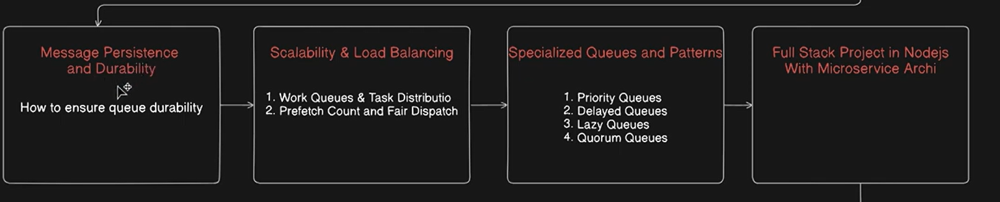
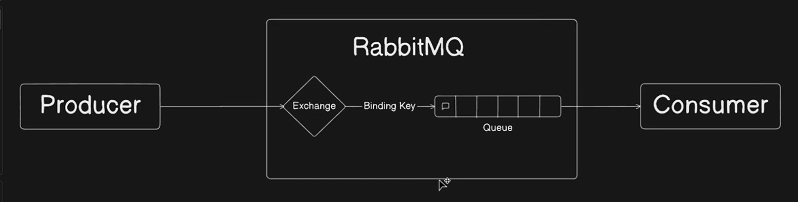
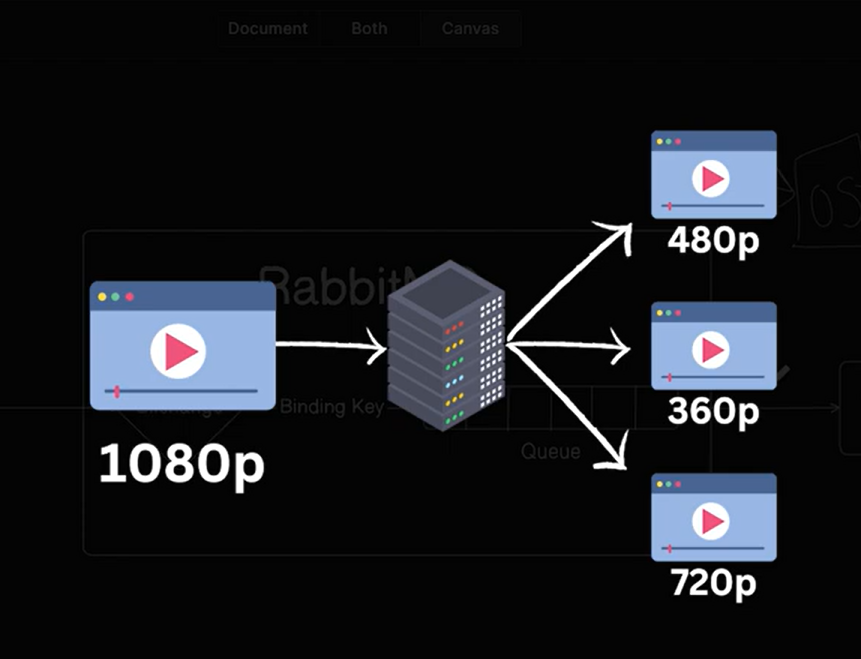
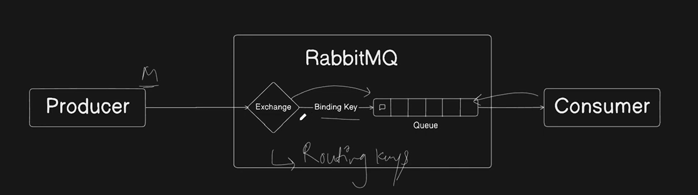

# Rabbit MQ

- 
- 

## Message Brokers, Queues, Exchanges, Binding & Routing keys

- 
- RabbitMQ is a message broker, which main responsibility is to take the data from producer and give it back to the consumer.
- We use Message Broker to achieve decoupling.
- Let say there are two different servers, now we do not have direct communication between these two servers. Here comes the message broker which helps us to communicate between servers.

- The main question is why do you need to have communication between two servers ?
    - When we are purchasing something from ecommerce website then it always happens we get an email. Having said that, let say we are purchasing from one server, we are receiving the email from another server.
    - So, the server which is taking the order must communicate with the another server so that another server can send the email to the user.
    - When the order is purchased then only we are supposed to receive the email right.
    - OrderService and MailingService must communicate with each other using message broker.
    - When the order is places then the OrderService will send the data to the message broker and then that message broker will further send the data to the MailingService and the MailingService will mail the user.
    - This is how two servers communicate with each other.
    - For example let say we are uploading any video of 1080p format and now the viewer have the option to view it in different quality how ?
        - 
        - The whole process is asynchronous.
    - We can also categorize this whole process as distributed computing.
    - RabbitMQ is a message broker which have multiple queues inside it.
    - The work of RabbitMQ is to take the data from the producer and give it to the consumer.
    - Producer does directly put the data into the queue of MQ and neither the Consumer consumes data directly from the queue.
    - Producer will first go to the exchange, Exchange knows on what queue the data is needed to be put as their can be many queues right all over the application. It may happen that individual queues are connected with different microservices.
    - So there can multiple consumers which are consuming the data from multiple queues.
    - Exchange will always have the correct queue information where to put the data, It will never happen that the exchange will put the data in the wrong queue.
    - There can be two keys routing key and binding key.
    - Binding key connects the queue to the exchange and setups the connection.
    - Routing key helps the exchange that on which queue the data should be put.
    - With the help of routing key the consumer will know through which queue the data is needed to be consumed.
    - Exchange will have separate types :-
        1. Direct
        2. Topic
        3. Fanout
        4. Headers
    - 
    - While system designing we categorize work in two different parts :-
        1. Important work 
            - All the important work will be done on the first place itself.
        2. Non-important work 
            - All the non-important work can be done asynchronously.
            - The work which is not making the user to wait to perform any kind of operation can be made async.
## Install and Setup RabbitMQ using Docker.
- Download the docker from here and then just execute the .exe file of the docker.
[Docker Download link](https://docs.docker.com/desktop/setup/install/windows-install/)
